  

  
 

## 👋 About

CS undergraduate with a solid grounding in object-oriented programming and software engineering, driven by **AI, machine learning, and data science**. I like tracing problems to their root cause, testing the edge cases, and building things that actually work.

## 🧰 Skills

| | |
|---|---|
| **Programming** |     |
| **Software development** |        |
| **Databases** |     |
| **AI & automation** |     |
| **QA & testing** |      |
| **Agile & DevOps** |     |

---

## 🤝 Community

- **Marketing Lead, Association of Software Engineering (ASE)**, NSBM
- **Council Member, FOSS Community Club**

---

## 📬 Connect with me

Hiring for an **internship** , or building something ambitious? Email is the fastest way to reach me.

